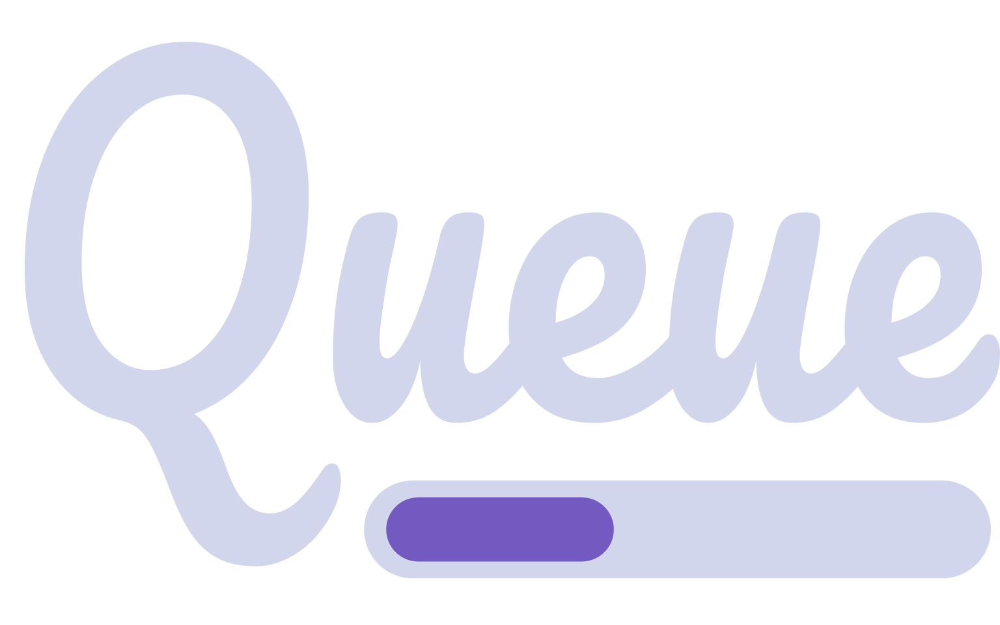
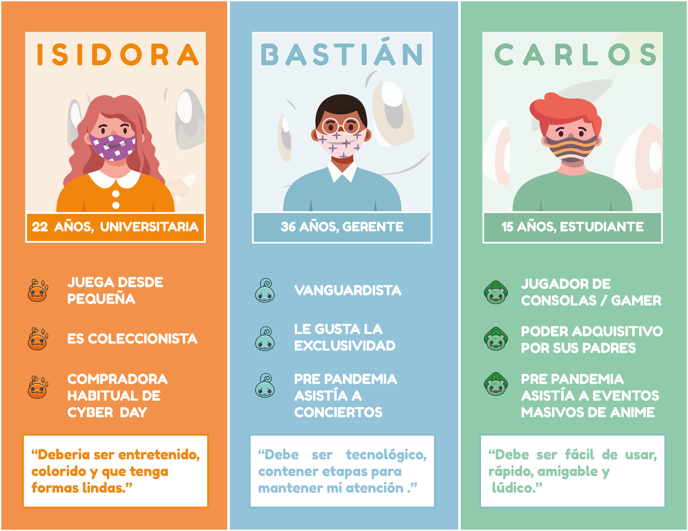
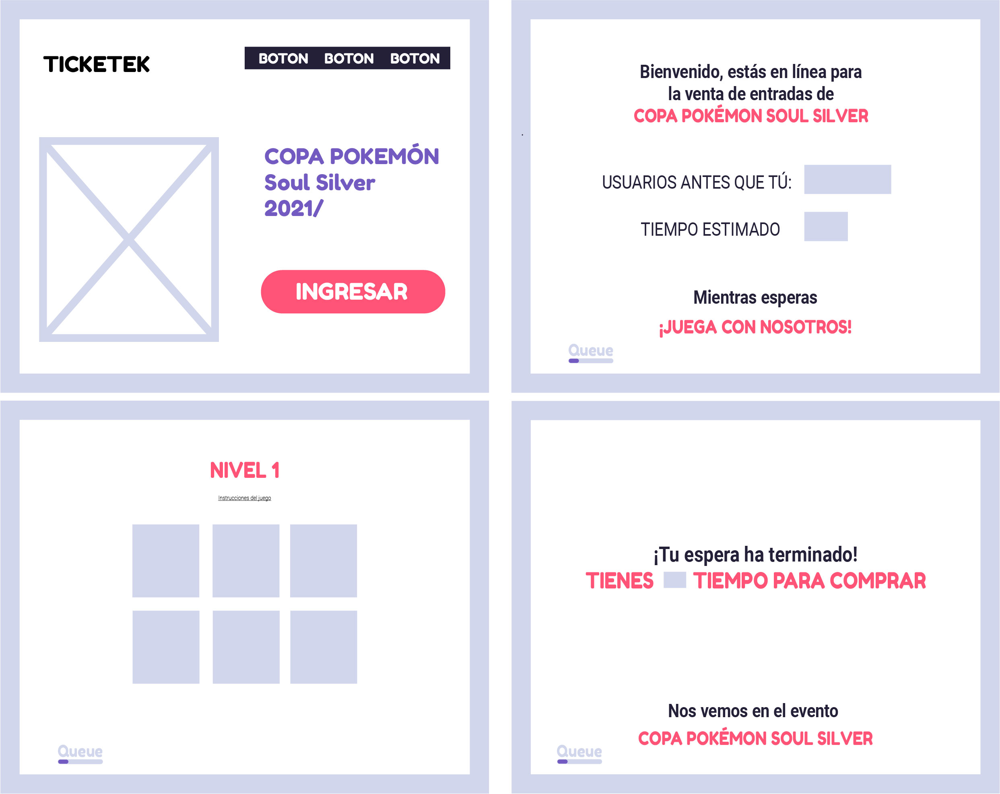
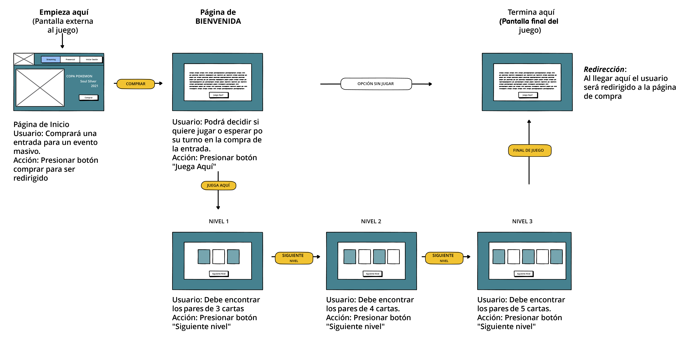

# Queue

## Índice

* [¿Qué es Queue?](#¿qué-es-Queue?)
* [Historias de Usuario](#historias-de-usuario)
* [Diseño de intefaz](#diseño-de-interfaz)
* [Test de usabilidad](#test-de-usabilidad)

***

 
 
### ¿Qué es **Queue**?

Queue es un una herramienta de entretención a través de un juego de memoria con niveles de dificultad que permite jugar mientras se debe esperar en una fila online. Nos dimos cuenta que, debido a la pandemia, se ha incrementado el consumo de eventos o compras online y por lo mismo se generan filas de espera en las que es muy posible que a un usuario se le haga difícil mantenerse atento y esperar.
 
***
 
####   Instrucciones de uso
Con Queue mientras haces la fila online puedes decidir esperar o entretenerte mientras lo haces. En este caso, puedes hacerlo a través de un juego de memoria en el que debes encontrar el par de cartas que contengan la misma imagen, una vez que destapas todos los pares pasas al siguiente nivel.

***
### Historias de usuario

### Diseño de Interfaz
 
- **Página de inicio**: Página externa al juego en donde puede 
 
 

 
 
- **Bienvenida al juego**: Aquí se pueden apreciar 3 tipos de productos que ofrece la marca, solamente se puede ver y no interactuar con estos por el momento.
 
 

 
- **Pago**:  En la página final sólo tendremos la opción de ingresar datos de una tarjeta de crédito, así se realizará el pago del producto seleccionado. 
 
 

### En iPhone 6/7/8+
 
 
 
### Prototipo de Baja Fidelidad / Diagrama de flujo
*** 

 
> 
   
 
 ***          
 
> 
- *Gracias a esto notamos cual sería el desarrollo que ibamos a seguir.*  
 

 

***
 
### Test de usabilidad
 

